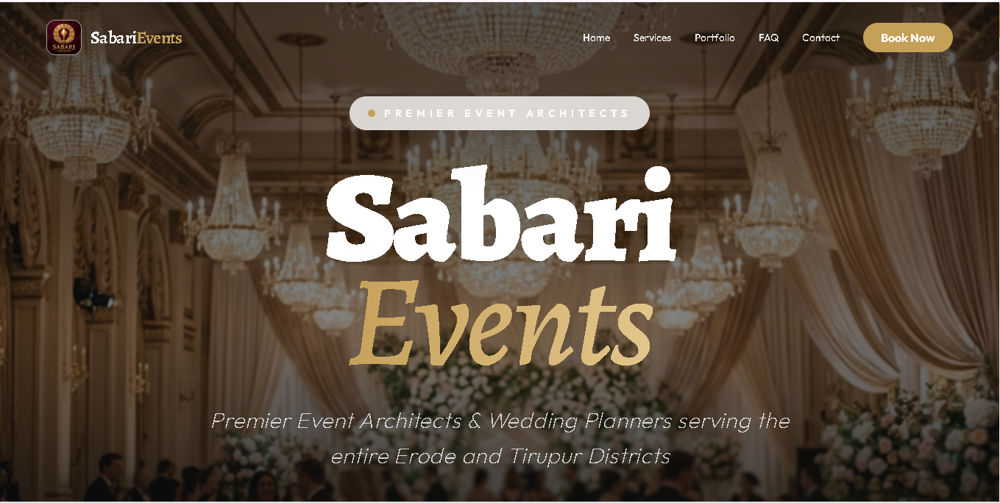

# 🏗️ Sabari Events — Premium Event Architecture

[](https://vitejs.dev/)
[](https://reactjs.org/)
[](https://tailwindcss.com/)
[](https://www.framer.com/motion/)

A state-of-the-art, high-conversion event management platform designed for **Sabari Events**, the premier event architects in Erode and Tirupur districts. This website combines cinematic aesthetics with a robust digital infrastructure to showcase luxury event planning across Tamil Nadu.

---

## ✨ Key Features

- **💎 Ultra-Premium Aesthetic**: Modern "Glassmorphism" UI with cinematic animations and a curated luxury color palette (Gold, Dark Charcoal, Cream).
- **🌍 Bi-Lingual Support**: Full English and Tamil localization with a seamless language switcher and persistence.
- **🎬 Dynamic Visuals**: Smooth scroll-triggered animations using Framer Motion and high-fidelity bento-style galleries.
- **📱 Fully Responsive**: Optimized for every device, from mobile handsets to large high-resolution desktops.
- **🔍 SEO Engineered**: Advanced meta-tagging for local SEO (Erode/Tirupur targeting) to ensure high search rank for event management services.
- **📋 Smart Inquiry System**: Integrated contact forms and direct WhatsApp/Phone touchpoints.
- **⚡ High Performance**: Built on Vite 7 and Tailwind CSS 4 for blistering load speeds and smooth UX.

---

## ✨ Visual Showcase

Experience the ultra-premium aesthetic of Sabari Events through our curated design.

| **Section**                  | **Desktop View**                             |
| :--------------------------- | :------------------------------------------- |
| **Hero & Branding**          |           |
| **Luxury Services**          |  |
| **Cinematic Gallery**        |    |
| **Modern Contact & Inquiry** |          |

### 📱 Responsive Mobile Design

Our platform is engineered to look stunning on every device, ensuring a seamless luxury experience on the go.

<div align="center">
  
</div>

---

## 🛠️ Technology Stack

| Architecture      | Technology                                                       |
| :---------------- | :--------------------------------------------------------------- |
| **Framework**     | [React 19](https://react.dev/)                                   |
| **Build Tool**    | [Vite 7](https://vite.dev/)                                      |
| **Styling**       | [Tailwind CSS 4](https://tailwindcss.com/) (Next-gen CSS Engine) |
| **Animations**    | [Framer Motion](https://www.framer.com/motion/)                  |
| **Icons**         | [Lucide React](https://lucide.dev/)                              |
| **UI Components** | [Radix UI](https://www.radix-ui.com/)                            |
| **Localization**  | Custom Context-based I18n System                                 |

---

## 🚀 Getting Started

### Prerequisites

- [Node.js](https://nodejs.org/) (v18.0.0 or higher)
- [npm](https://www.npmjs.com/) or [yarn](https://yarnpkg.com/)

### Installation

1.  **Clone the repository:**

    ```bash
    git clone https://github.com/your-username/sabari-events.git
    cd sabari-events
    ```

2.  **Install dependencies:**

    ```bash
    npm install
    ```

3.  **Run Development Server:**

    ```bash
    npm run dev
    ```

    The application will be available at `http://localhost:5173`.

4.  **Build for Production:**
    ```bash
    npm run build
    ```

---

## 📂 Project Structure

```text
src/
├── components/         # High-level UI sections (Hero, Services, Gallery, etc.)
│   └── ui/             # Reusable atomic components (Button, Input, Accordion)
├── context/            # Global state (Language/Theming)
├── lib/                # Shared utilities and localization strings
├── assets/             # Images and static media
├── index.css           # Global design system & Tailwind layers
└── App.jsx             # Root layout and section assembly
```

---

## 🎨 Design System

Our design philosophy centers on **"Modern Luxury"**:

- **Typography**: `Alegreya` for grand titles (Serif) and `Outfit` for modern body text (Sans).
- **Colors**:
  - `#c5a059` (Premium Gold)
  - `#0d0d0d` (Deep Charcoal)
  - `#faf9f6` (Antique Cream)
- **Effects**: Blur-intensive glass masks, soft golden glows, and cinematic motion curves.

---

## 🗺️ Localization

The platform currently supports:

- **English (EN)**: Global professional standard.
- **Tamil (TA)**: Local region-specific dialect for Erode, Tirupur, and broader Tamil Nadu.

Languages can be switched via the global navigation bar or the initial entry modal.

---

## 📞 Contact & Support

For business inquiries or technical questions:

- **Website**: [sabarievents.in](https://sabarievents.in)
- **Location**: Bharathi Palayam Street, Erode - 638002
- **Email**: sabarieventmanagement@gmail.com
- **Phone**: +91 85084 02318

---

_Built with ♥ for world-class celebrations._
